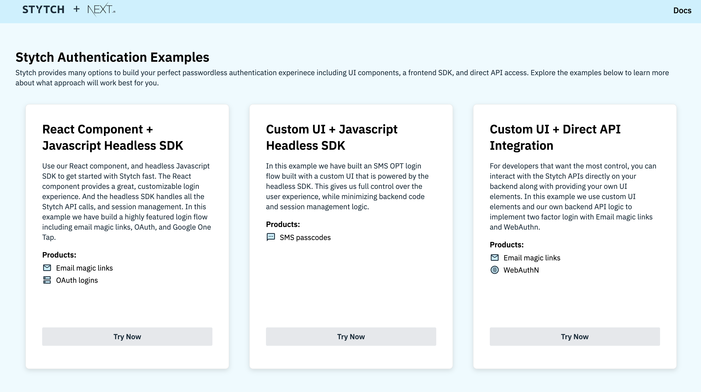

# Stytch + Next.js Example App

This is a [Stytch](https://stytch.com) + [Next.js](https://nextjs.org/) project bootstrapped with [`create-next-app`](https://github.com/vercel/next.js/tree/canary/packages/create-next-app). **Check out a live version of this site [here](https://www.stytchdemo.com).**


<p align="center"></p>

In this repo, we have three sample auth flows:

- SDK with React component: This flow uses Stytch's React component to create a login and sign-up flow using [Email magic links](https://stytch.com/products/email-magic-links) and [OAuth logins](https://stytch.com/products/oauth).
- SDK with custom UI: This flow uses a custom UI with Stytch's headless SDK to implement [Onetime Passcodes(OTP) via SMS](https://stytch.com/products/sms-passcodes) authentication.
- Direct API: This flow uses a custom UI with Stytch's backend API for a two step authenticaiton which requires [Email magic links](https://stytch.com/products/email-magic-links) and [WebAuthn](https://stytch.com/products/webauthn).

**Note:** By default this example app enables five of our OAuth providers, Google, Microsoft, Facebook, Github, and Apple. If you haven't set up these OAuth providers in your [Dashboard](https://stytch.com/dashboard/oauth), you'll receive a redirect error when you attempt to login via those providers. You may remove all OAuth methods by removing `SDKProductTypes.oauth` from the `products` array in [components/LoginWithReactSDK.tsx](components/LoginWithReactSDK.tsx) or adjust which ones are displayed by via `oauthOptions.providers` in the same file. More detail on working with OAuth providers in our SDK may be found in our [Docs](https://stytch.com/docs/javascript-sdk#javascript-sdk/oauth).

# Running with Vercel

If you'd like to run this example app with [Vercel](https://vercel.com/), the first step is to configure the appropriate redirect URLs for your project.

You'll set these magic link redirect URLs in the [Redirect URLs](https://stytch.com/dashboard/redirect-urls) section of your Dashboard. Add `https://*.vercel.app/authenticate` as both a login and sign-up redirect URL. If you'd like to try our [WebAuthn](https://stytch.com/docs/api/webauthn-overview) example integration, add `https://*.vercel.app/api/authenticate_magic_link_with_webauthn` as a login and sign-up redirect URL as well.

Additionally, you will need to configure the headless SDK settings. In your [SDK Configuration](https://stytch.com/dashboard/sdk-configuration) add `https://*.vercel.app` as an authorized domain and toggle on the Auth methods "Email magic links", "OAuth", and "SMS passcodes (OTP)".

**Note:** To use Google One Tap in this example app, you'll need to deploy on Vercel first, then add the resulting URL, e.g. `https://<uuid>.vercel.app/` as both a Stytch Redirect URL and as a [Authorized JavaScript origins](https://console.cloud.google.com/apis/credentials/) in your Google OAuth dashboard.

Now just click the deploy button below! Once you're signed in to your Vercel account, you'll be guided through how to get up and running quickly. Check out [.env.template](/.env.template) for pointers on filling in the appropriate environment variables for this step.

[](https://vercel.com/new/clone?repository-url=https%3A%2F%2Fgithub.com%2Fstytchauth%2Fstytch-nextjs-integration&env=STYTCH_PROJECT_ENV,STYTCH_PROJECT_ID,STYTCH_SECRET,STYTCH_PUBLIC_TOKEN,IRON_SESSION_PASSWORD,IRON_SESSION_COOKIE_NAME&envDescription=All%20variables%20here%20need%20values%2C%20see%20the%20following%20link%20for%20pointers%20on%20how%20to%20feel%20these%20out.&envLink=https%3A%2F%2Fgithub.com%2Fstytchauth%2Fstytch-nextjs-integration%2Fblob%2Fmain%2F.env.template&project-name=stytch-nextjs&repo-name=stytch-nextjs&demo-title=Stytch%20on%20Next.js&demo-description=Next.js%20example%20app%20using%20Stytch%20authentication&demo-url=https%3A%2F%2Fgithub.com%2Fstytchauth%2Fstytch-nextjs-integration&demo-image=https%3A%2F%2Fgithub.com%2Fstytchauth%2Fstytch-nextjs-integration%2Fblob%2Fmain%2Fpublic%2Fexample-app-image.png)

# Running locally

## Setting up Stytch

After signing up for Stytch, you'll need your Project's `project_id`, `secret`, and `public_token`. You can find these in the [API keys tab](https://stytch.com/dashboard/api-keys).

Once you've gathered these values, add them to a new .env.local file.
Example:

```bash
cp .env.template .env.local
# Replace your keys in new .env.local file
```

Next we'll configure the appropriate redirect URLs for your project, you'll set these magic link URLs for your project in the [Redirect URLs](https://stytch.com/dashboard/redirect-urls) section of your Dashboard. Add `http://localhost:3000/authenticate` as both a login and sign-up redirect URL. If you'd like to try our [WebAuthn](https://stytch.com/docs/api/webauthn-overview) example integration, add `http://localhost:3000/api/authenticate_magic_link_with_webauthn` as a login and sign-up redirect URL as well.

## Running the example app

Install dependencies by running

```bash
npm install
# or
yarn install
```

You can then run a development server using:

```bash
npm run dev
# or
yarn dev
```

Open [http://localhost:3000](http://localhost:3000) with your browser to see the result.

## Documentation

Learn more about some of Stytch's products used in this example app:

- [Stytch Web SDK](https://www.npmjs.com/package/@stytch/vanilla-js)
- [Stytch NextJS](https://www.npmjs.com/package/@stytch/nextjs)
- [Stytch's node client library](https://www.npmjs.com/package/stytch)
